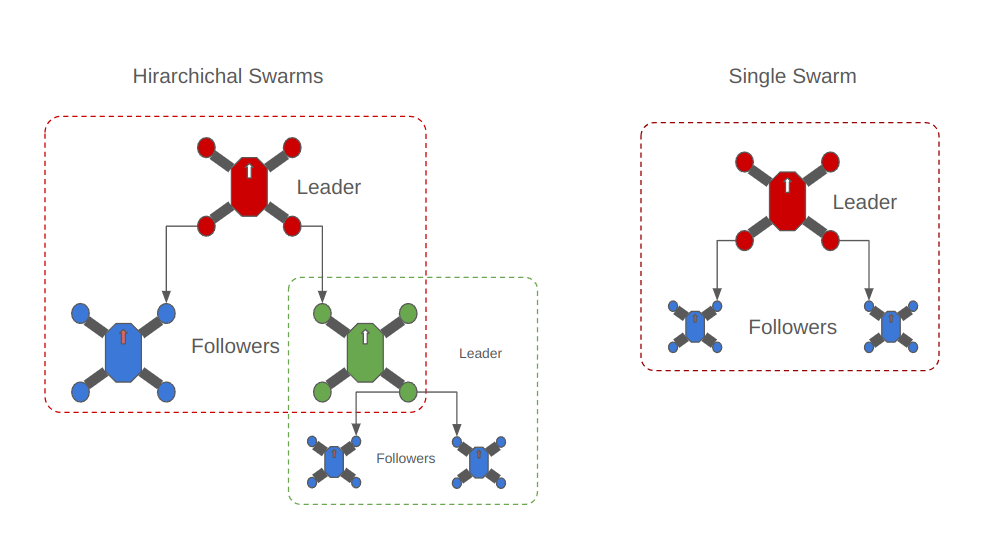
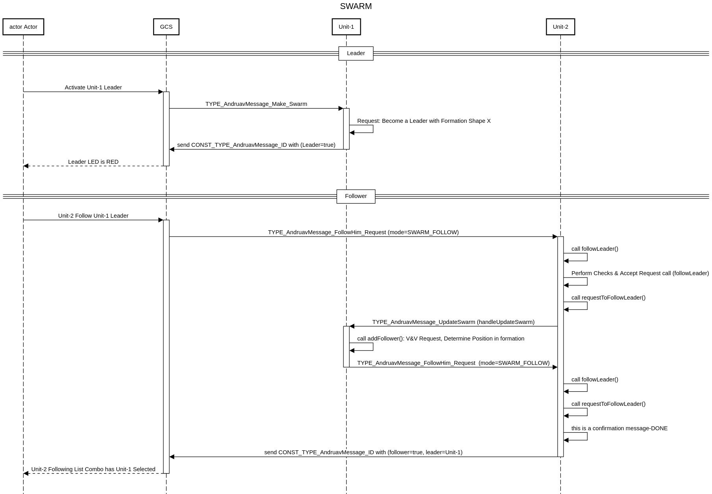

# DroneEngage SWARM

The DroneEngage SWARM system is designed to facilitate the coordination and management of drone formations. Each swarm comprises a single leader drone and multiple follower drones, enabling efficient operation in various scenarios.

## Features

-   **SWARM Composition**: Each swarm consists of one leader drone and multiple follower drones.
    
-   **Formation Management**: Each swarm maintains a specific formation, with each follower assigned a unique position referred to as its index.
    
-   **Hierarchical Structure**: Follower drones can assume the role of leaders within their own sub-SWARMs, creating a hierarchical organization. This allows for complex operational strategies where each follower can have its own set of followers.
    
-   **Independent Operation**: Grandchildren followers operate independently from their grandparent leader. This allows for flexibility and autonomy during missions.
    
-   **Dynamic Formation**: The swarm formation can be adjusted dynamically during execution, enabling real-time adaptations to changing circumstances.
    

## Missions & Plans

The Drone-Engage Mission Planner allows you to manage the creation of swarms during missions. You can design missions where swarms are dynamically generated and synchronized, enabling coordinated operations through the triggering of various events across the system.
	

## Development Section

  

Unit-1 is a DroneEngage unit that should be a leader of the swarm. Unit-2 is a DroneEngage unit that should be a follower of the swarm.

### Unit Roles

-   **Unit-1**: Designated as the leader of the SWARM.
-   **Unit-2**: Designated as a follower within the SWARM.

#### Transition to Leader

The process for establishing Unit-1 as the leader is as follows:

1.  The user clicks the "SWARM Leader" button to designate Unit-1 as the leader.
2.  The WebClient sends an `AndruavMessage_Make_Swarm` message to Unit-1.
3.  Upon receiving the message, Unit-1 initiates SWARM Leader mode.
4.  Unit-1 sends an updated `AndruavMessage_ID` to confirm its status as the leader.

#### Transition to Follower

The process for establishing Unit-2 as a follower is as follows:

1.  The user selects Unit-1 as the leader for Unit-2.
2.  The WebClient sends an `AndruavMessage_Join_Swarm` message to Unit-2.
3.  Unit-2 receives the message and performs necessary validations, including disassociating from any previous leader, before sending a request to Unit-1 to join the SWARM.
4.  Unit-1 receives the request and determines the appropriate location (index) for Unit-2 within the current swarm configuration.
5.  Unit-1 responds to Unit-2 with the relevant configuration details (formation shape and location within the formation).
6.  Unit-2 receives the configuration reply and, if accepted, sends a confirmation back to Unit-1.
7.  Unit-2 then sends an updated `AndruavMessage_ID` to confirm its status as a follower.

## Follower Index Assignment

Each follower in the swarm is assigned a unique **follower index** by the leader. This index determines the follower's slot in the formation and is critical for avoiding duplicate targets.

### How Indices Are Assigned

- `CSwarmManager::insertFollowerInSwarmFormation` assigns the **smallest missing index** starting from 0. It collects all used indices, sorts them, then scans for the first gap — this ensures correctness even after mid-vector deletions cause element reordering.
- The index is stored in `ANDRUAV_UNIT_FOLLOWER::follower_index` on the leader side.
- The leader sends the index to the follower via `requestFromUnitToFollowMe`.
- The follower stores it in `m_follower_index` via `followLeader()`.

### Index Sync on Formation Change

When the leader changes formation (`SWARM_CHANGE_FORMATION`), the message includes the follower's index in field `a`. The follower calls `followLeader()` with this index to stay in sync with the leader's records. This prevents stale/wrong indices from persisting across formation changes.

### Re-adding an Existing Follower

`addFollower` checks if the follower already exists in `m_follower_units`. If so, it uses the stored `it->follower_index` (not the vector position) when re-sending `SWARM_FOLLOW`. This ensures the follower always receives its originally assigned index.

## V Formation (Arrow) Side Assignment

In V/Arrow formations, each follower occupies a unique **(side, tier)** slot determined by its index:

| follower_index | wing   | tier | base_distance          |
|----------------|--------|------|------------------------|
| 0              | left   | 1    | 1 × min_horiz_dist     |
| 1              | right  | 1    | 1 × min_horiz_dist     |
| 2              | left   | 2    | 2 × min_horiz_dist     |
| 3              | right  | 2    | 2 × min_horiz_dist     |

- **Side** is determined by `follower_index % 2`: even → left wing, odd → right wing.
- **Tier** (distance from leader) is determined by `(follower_index / 2) + 1`.
- Multiple followers can share the same wing at different tiers — this is valid and expected.

### Why Side Is Fixed by Index (Not Physical Position)

An earlier implementation used cross-track position to dynamically assign each follower to a wing based on its physical location relative to the leader's heading. This caused a **duplicate-location bug**: if two followers happened to be on the same physical side of the leader, both would choose the same wing and compute the same target position.

Since each follower runs its side-assignment logic independently (decentralized), there is no coordination between followers to prevent collisions. Using `follower_index` parity as the sole side assignment guarantees a valid V shape without requiring inter-follower communication.

### FORMATION_ARROW_DYNAMIC vs FORMATION_ARROW

Both formations use index-based side assignment (parity) to guarantee a valid V shape without inter-follower coordination. The key difference is in **formation bearing** when the leader is stationary:

- **`FORMATION_ARROW`** (static): When the leader is stationary, the formation bearing is derived from the leader's compass heading (`hdg`) with a deadzone filter. The V points where the leader faces — yawing in place rotates the formation.
- **`FORMATION_ARROW_DYNAMIC`**: When the leader is stationary, the formation bearing is frozen at the last velocity-based bearing. The formation depends **only** on actual movement direction. If the leader has never moved, followers hold position until movement is detected.

Both formations share slew-rate limiting on the velocity bearing when the leader is moving, plus target-jump detection and low-pass smoothing on the goto target.
