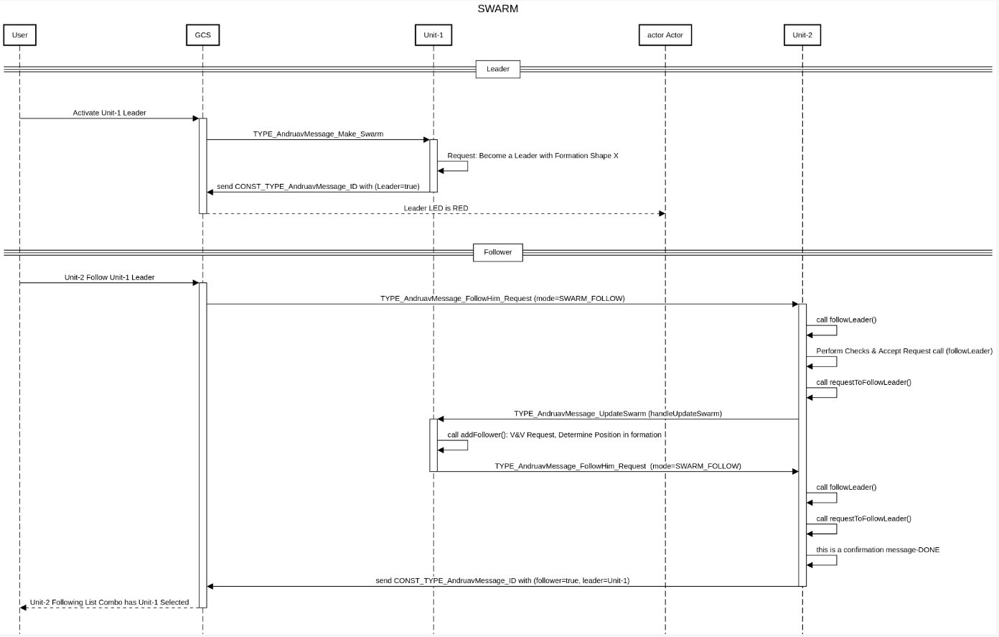

# DroneEngage SWARM

The DroneEngage SWARM system is designed to facilitate the coordination and management of drone formations. Each swarm comprises a single leader drone and multiple follower drones, enabling efficient operation in various scenarios.

## Features

-   **SWARM Composition**: Each swarm consists of one leader drone and multiple follower drones.
    
-   **Formation Management**: Each swarm maintains a specific formation, with each follower assigned a unique position referred to as its index.
    
-   **Hierarchical Structure**: Follower drones can assume the role of leaders within their own sub-SWARMs, creating a hierarchical organization. This allows for complex operational strategies where each follower can have its own set of followers.
    
-   **Independent Operation**: Grandchildren followers operate independently from their grandparent leader. This allows for flexibility and autonomy during missions.
    
-   **Dynamic Formation**: The swarm formation can be adjusted dynamically during execution, enabling real-time adaptations to changing circumstances.
    

## Missions & Plans

The Drone-Engage Mission Planner allows you to manage the creation of swarms during missions. You can design missions where swarms are dynamically generated and synchronized, enabling coordinated operations through the triggering of various events across the system.
	

## Development Section

  

Unit-1 is a DroneEngage unit that should be a leader of the swarm. Unit-2 is a DroneEngage unit that should be a follower of the swarm.

### Unit Roles

-   **Unit-1**: Designated as the leader of the SWARM.
-   **Unit-2**: Designated as a follower within the SWARM.

#### Transition to Leader

The process for establishing Unit-1 as the leader is as follows:

1.  The user clicks the "SWARM Leader" button to designate Unit-1 as the leader.
2.  The WebClient sends an `AndruavMessage_Make_Swarm` message to Unit-1.
3.  Upon receiving the message, Unit-1 initiates SWARM Leader mode.
4.  Unit-1 sends an updated `AndruavMessage_ID` to confirm its status as the leader.

#### Transition to Follower

The process for establishing Unit-2 as a follower is as follows:

1.  The user selects Unit-1 as the leader for Unit-2.
2.  The WebClient sends an `AndruavMessage_Join_Swarm` message to Unit-2.
3.  Unit-2 receives the message and performs necessary validations, including disassociating from any previous leader, before sending a request to Unit-1 to join the SWARM.
4.  Unit-1 receives the request and determines the appropriate location (index) for Unit-2 within the current swarm configuration.
5.  Unit-1 responds to Unit-2 with the relevant configuration details (formation shape and location within the formation).
6.  Unit-2 receives the configuration reply and, if accepted, sends a confirmation back to Unit-1.
7.  Unit-2 then sends an updated `AndruavMessage_ID` to confirm its status as a follower.
